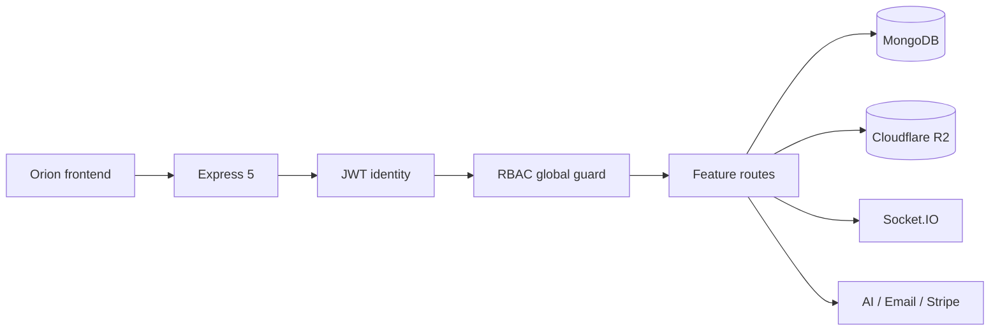

# Orion API

**The production backend behind Orion.**

Orion API is a modular Node.js service for [samyao.me](https://samyao.me). It owns authentication, role-based access, journals, projects, résumé data, R2 media, realtime chat, personal records, audit logs and AI-assisted workflows.

[Orion](https://samyao.me) · [Health check](https://bananaboom-api-242273127238.asia-east1.run.app/health) · [Frontend repository](https://github.com/yaohuangguan/orion-frontend)

## 已实现

- **身份与权限：** JWT 会话、Firebase 身份接入、角色与细粒度权限、权限申请及全局路由守卫。
- **内容平台：** 公开/私密日志、评论、标签、主页配置、双语简历、Web / Full Stack / Mobile 项目目录。
- **媒体服务：** multipart 上传、Cloudflare R2、图片处理和安全的远程媒体地址。
- **个人模块：** 待办、健身、照片、生理周期、足迹、阅读记录和定时任务。
- **AI 工具：** Gemini 与专用 AI 路由、流式响应、第二大脑上下文、辩论、RPG、绘图和语音地图服务。
- **实时通信：** Socket.IO 聊天和服务端事件。
- **运维能力：** 审计日志、备份、速率限制、安全响应头、压缩、健康检查和 Google Cloud Run 容器部署。
- **支付：** Stripe webhook 与产品价格配置。

## 请求路径



所有 `/api` 请求先经过温和身份解析，再由全局权限表决定公开访问、本人访问或管理员能力。公开文章详情仍会在数据层拒绝私密记录。

## 本地开发

需要 Node.js 22+ 与 pnpm 9+，以及可用的 MongoDB。

```bash
git clone https://github.com/yaohuangguan/new-bananaboom-api-2025.git
cd new-bananaboom-api-2025
pnpm install
pnpm dev
```

开发命令使用 Node 原生 `--env-file=.env`。至少配置：

```dotenv
NODE_ENV=development
PORT=5000
MONGO_URI=mongodb://127.0.0.1:27017/orion
SECRET_JWT=replace-with-a-long-random-secret
FRONTEND_URL=http://localhost:5173
```

按启用的模块再配置 Firebase、R2、Resend、Gemini、Stripe 等变量。不要提交 `.env`、服务账户 JSON、访问密钥或生产数据库地址。

## 常用可选配置

```dotenv
FIREBASE_SERVICE_ACCOUNT=...
R2_ACCOUNT_ID=...
R2_ACCESS_KEY_ID=...
R2_SECRET_ACCESS_KEY=...
R2_BUCKET_NAME=...
R2_PUBLIC_DOMAIN=...
RESEND_API_KEY=...
EMAIL_FROM=...
GEMINI_API_KEY=...
STRIPE_SECRET_KEY=...
STRIPE_WEBHOOK_SECRET=...
CRON_SECRET=...
```

## 质量验证

```bash
pnpm lint
pnpm test -- --runInBand
```

测试使用 Jest、Supertest 和 `mongodb-memory-server`，覆盖注册登录、会话载荷、全局权限、用户管理、公开/私密文章读取、健身数据隔离、补剂记录以及项目分类验证。测试数据库与生产数据库完全分离。

## 目录结构

```text
config/                 数据库、CORS、静态权限与服务配置
middleware/             身份解析、全局权限守卫和校验
models/                 Mongoose 数据模型
routes/                 业务与系统 API
services/               Firebase、权限、邮件和领域服务
socket/                 Socket.IO 事件处理
utils/                  AI、审计、上传和通用工具
tests/                  隔离的 API 与权限回归测试
index.js                Express / HTTP / Socket.IO 入口
Dockerfile              Cloud Run 容器构建
```

Node.js 22 · Express 5 · MongoDB / Mongoose · Socket.IO · Cloudflare R2 · Firebase Admin · Gemini · Stripe · Resend · Jest · Supertest。

## 安全与数据边界

- Helmet 与自定义安全头限制嵌入、MIME 猜测和来源泄漏。
- CORS 使用显式配置；生产部署应只允许可信前端域名。
- 权限由后端执行，不能依赖前端隐藏按钮。
- Stripe webhook 在 JSON body parser 之前保留原始请求体用于签名校验。
- R2、Firebase、邮件、AI 和支付密钥只存在于服务端环境变量。
- 备份、日志和个人模块可能包含敏感数据；生产访问应遵循最小权限原则。

## 部署

仓库包含 Dockerfile，可部署到 Google Cloud Run 或其他支持 Node 容器的平台：

```bash
docker build -t orion-api .
docker run --env-file .env -p 5000:5000 orion-api
```

部署后使用 `/health` 作为存活检查，并把 `FRONTEND_URL`、CORS、回调地址和公开 R2 域名设置为正式环境值。

这是 Orion 的配套服务。欢迎提交 issue 或 pull request；提交前请运行 lint 与完整测试，并确保变更不会扩大任何私密数据的访问范围。
